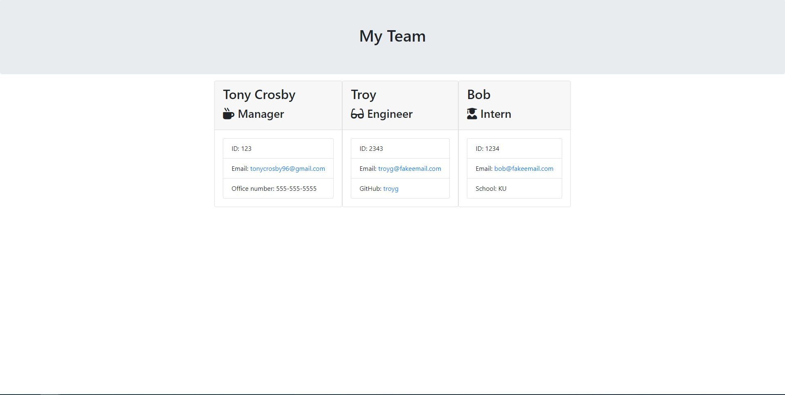

# 10_Employee_Summary

# Description

This application will prompt the user for information about the team manager and then information about the team members.

# Table of Contents

- [Installations](#Installations)
- [Usage](#Usage)
- [License](#License)
- [Credits](#Credits)
- [Test](#Test)
- [Contributing](#Contributing)

# Installations

> ( npm i ) and ( node app.js )

# Usage

This is a a software engineering team generator command line application that dynamically generates a visual team summary with user's input using the Inquirer package.

# License

None

# Credits

Tony Crosby

# Test

test

# Acceptance Criteria

Functional app will include:

- Accepts user input

* Generates webpage that displays basic team info:
  - Name
  - E-mail
  - ID

- Team should consist of one manager and any number of engineers and interns

- Interns should include their education institution in their summary

- Engineers should include their Github in their summary

- Includes Inquirer and Jest as listed dependencies in package.json

- Uses Jest dependency and passes tests located in the 'test' folder

The following animation demonstrates the client's request for application functionality:

Example Demo:

Application Demo:

Video Demo:
[Video Demonstration of Application](https://drive.google.com/file/d/1MbYRkSwhlShWviCmvnTir-Gj_H88itM1/view)

GitHub Repository: https://github.com/tonycrosby-tech/10_Employee_Summary/

# Criteria Determination:

This application provides a fully functional command line application using Node.js, Inquirer.js, and Jest.js to generate a visual employee team summary for the client.

For additional information, please e-mail the project manager: tonycrosby96@gmail.com
